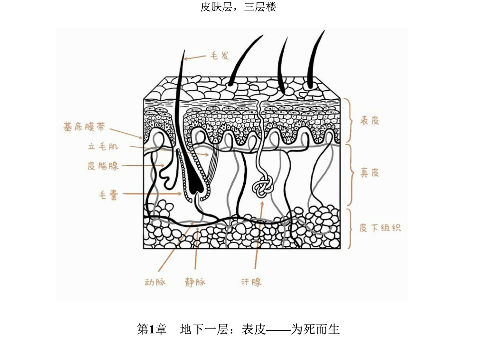
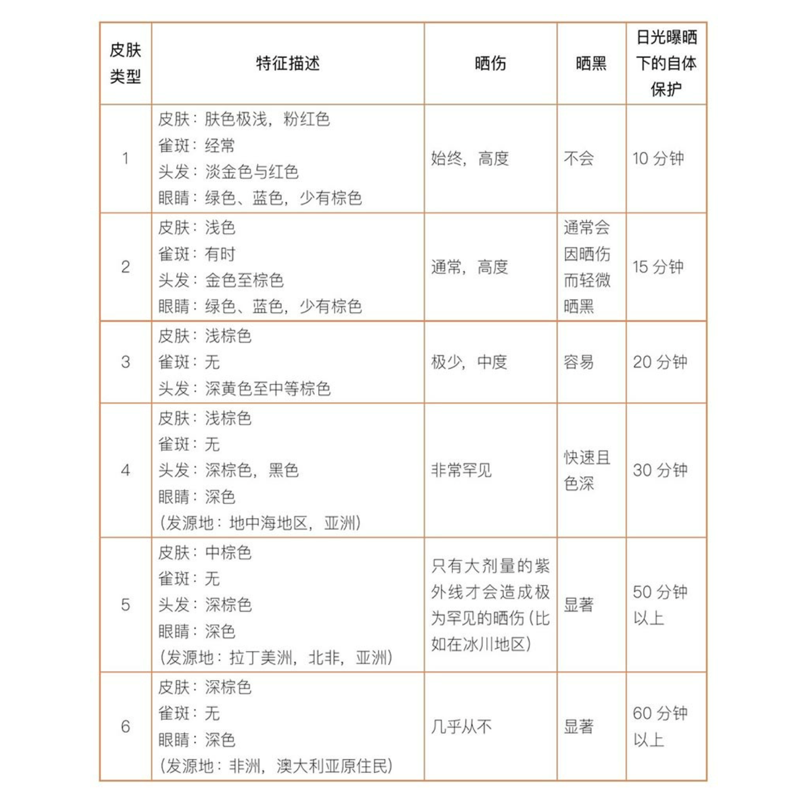
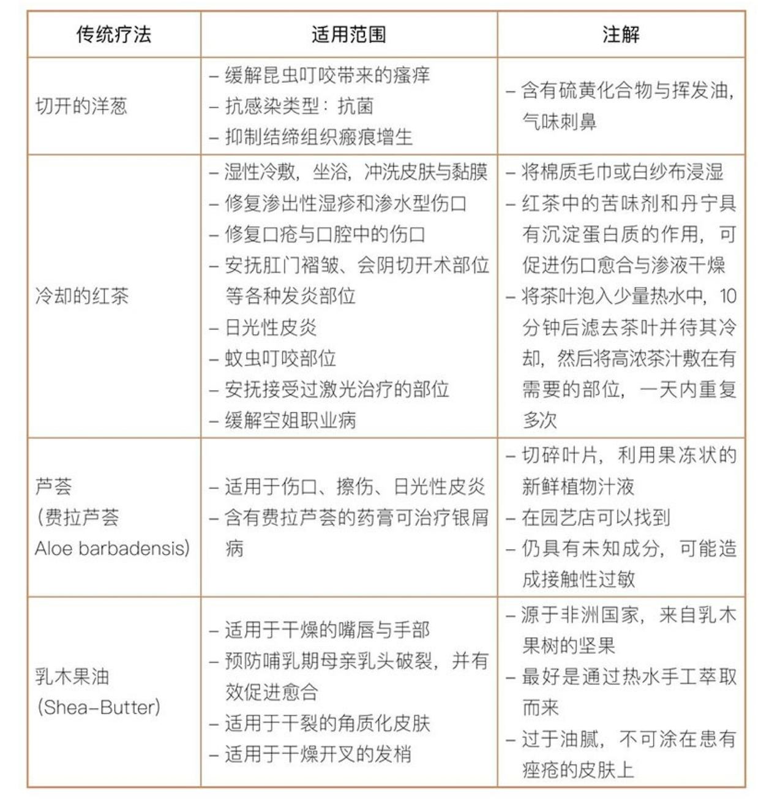
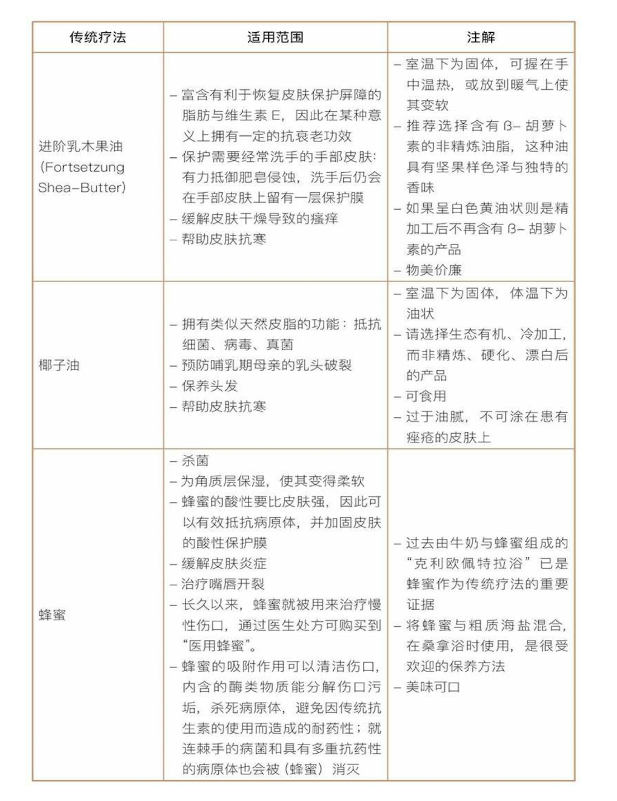

- **书名**：皮肤的秘密： 关于人体最大器官的一切
- **作者**：耶尔。阿德勒
- **译者**： 刘立
- **其他**：2019，东方出版社

- **基本观点**：皮肤能自我治理，生活起居上该注意的注意，其他的，人应该尽量无为而治。

# 皮肤的构造

- 两种不同皮肤类型的人结合，后代的皮肤大概率会更好。基因多样性对皮肤很重要。

- 胚胎期时，皮肤与神经系统来自于相同的细胞层。

- 皮肤有三层：（1）角质层。（2）真皮层。（3）皮下组织。

 

### 表皮层

- 表皮是我们可以直观看到并感受到的皮肤层，通常仅有0.05～0.1毫米厚。人的表皮整体呈酸性（PH 4.7～5.5，阴道为3.8～4.5）。皮肤的酸性来自角质细胞废料、皮脂、汗水等新城代谢物等等。
	- 破腹产不利于皮肤微生物菌落的形成，因为胎儿“失去了获得母亲阴道细菌的机会“）。

- 表皮结构，由下至上。表皮细胞适用幼儿细胞，以四星期为周期，从基底细胞层逐渐向上推移、角化、变形，直到成为顶部的由角质细胞构成的、具有保护屏障作用的角质层结束。**就护肤而言，关键就在维护或修护角质层**。
	- 基底细胞层（幼儿细胞层）
	- 棘层（青春期活跃生长层）
	- 颗粒层（成人层）
	- 角质层（一层死去的细胞，角蛋白）

- 皮屑：脱落的角质细胞。从表皮细胞到角质细胞一般要四周，如果这个过程太快，细胞“发育”不充分，容易造成发炎和大量脱落的角质细胞。大量皮屑由此而生。

- 皮肤褶皱会造成皮肤不透气，造成皮肤的水分无法充分蒸发而聚集，导致皮肤保护屏障迅速软化。这些聚集的水分连同汗水会变成自刺激物，引起一些感染。
	- 臀部褶皱是人体最大的褶皱。
	- 臭味是疾病的预兆。
	- 出现问题，不能过分清洗。**最好用酸性的人工合成清洁剂，PH为5.5来洗**。保持出现问题的皮肤褶皱处的干爽，比如选择透气的衣服之类。

- **气味腺**：一种特殊的汗腺，与毛囊相连，以散发吸引异性的费洛蒙，是人体自带的“香水”。其分泌物呈乳白色、微黏，具有弱碱性，会将原来酸性的皮肤碱性化。

- **表皮黑素细胞**决定肤色。黑素细胞是由神经组织与神经嵴（Neuralleiste）发展而来的其中一种细胞，在胚胎发育时期就分化出来，当其他同伴全变成神经系统细胞时，黑素细胞却开始往皮肤方向漫游。不仅早期漫游时期，乃至一生它们都十分活跃。一些情况下，黑素细胞会癌变成黑色素细胞瘤（malignes Melanom），并且很容易就近扩散，甚至发生远端转移，是一种灾难性的黑色皮肤癌。
	- 不管肤色是深是浅，还是纯黑，都有着同等数量的黑素细胞。不同之处在于，同等条件下，深色与黑色皮肤中的每个黑素细胞能产生600个色素小球，而浅色皮肤仅会产生2～12个，并且前者的体积也要大很多。此外，肤色还取决于皮肤中的两种黑色素比例，即棕黑系的真黑素（Eumelanin）与红黄系的褐黑素（Phäomelanin），哪种占的份额多，我们的肤色、发色与眼睛便倾向于哪种色系。
	- 当大量黑素细胞或痣细胞以巢状聚集时，会形成痣。痣细胞对人体来说没有任何用处。

- **胡萝卜汁防晒**：大量饮用胡萝卜汁，有时会把皮肤染成橘黄色，不用担心，这是来自天然ß-胡萝卜素中的健康色素，每人每日应摄入2～4毫克胡萝卜素。此外，只有当每天摄入30毫克胡萝卜素，也就是说，每天拿1斤胡萝卜生吃或榨成汁喝，或者吃药店买的胡萝卜素胶囊，持续三周时间，肤色才会略微变橙。这种轻微的着色可以增强皮肤对阳光的抵抗力，因此，日光性皮炎患者在度假前可以摄入一些ß-胡萝卜素进行预防。胡萝卜素肤色可以让人在阳光下停留1个小时，而普通皮肤最多只能忍受10～20分钟。

### 真皮层

- 与单薄的表皮相比，真皮大约有2毫米厚，里面充满了致密的结缔组织，赋予皮肤一定的稳固性。结缔组织中的胶原蛋白纤维（Eiweißfäden）有着很高的抗拉强度，与可伸缩的弹性纤维（Sprungfasern）以螺 旋状交织在一起，从而保证皮肤在被拉扯后能回归原位。不幸的是，随着时间推移，皮肤会渐渐变得松弛无力，一方面来自于自然老化过程，另一方面则是加速老化进程的外界“催化剂”所致，**日晒、日光浴、烟草、压力、睡眠不足、营养不良、缺乏运动**等都会加速弹性纤维的流失。
	- **比一比屁股上的皮肤和脸上的皮肤。。。**
	- 皮肤老化主要发生在地下二层的真皮，波及的一是结缔组织细胞，即通常所说的成纤维细胞，它们形态各异，散落分布于真皮层中；二是由成纤维细胞的产物结缔组织纤维，即胶原蛋白和弹性蛋白。
	- **胶原蛋白**由坚韧的蛋白质纤维组成，赋予皮肤稳定性和抗张能力；弹性蛋白 则是构成弹性纤维的主要成分，赋予皮肤延展性。对人类来说，弹性纤维的半衰 期很长，约为70年；但它只会在我们一岁时生长成型，往后再也不会长出新的， 没了也就真的没了。

- 通常情况下，皮肤可以很好地适应寒冷环境。冬季，暖气的热风与室外干燥 的空气都会使皮肤丧失大量水分，变得干燥。尽管如此，也无需频繁涂擦润肤霜，而是当皮肤感觉特别干时再用。保湿霜应仅在晚上睡前使用，且也是在必要时，否则将会导致皮肤变得更干。如果在特别冷的天里涂完保湿霜就立马出门， 由于护肤霜的高含水量，皮肤很容易冻伤。

- 皮脂是皮肤的第二大油脂来源，发挥着保养与保护功能。对皮肤来说，皮脂相当于一种混合有多种脂肪与蜡的营养护肤霜，可以保持皮肤柔软，散发健康的淡淡光泽。梳头与头部按摩可以增加头发光泽度，是因为皮脂在梳按过程中从头部转移到了头发上。
	- 许多护肤品都宣扬自己的产品能够调控皮脂腺，有效控制皮肤出油。简直是 一派胡言！皮脂腺位于皮肤深处，**油脂位于地下二层，任何护肤霜都无法渗入这里**，就连抗痤疮的处方药也对皮脂的过度分泌无可奈何。

### 皮下组织

- 皮下组织不仅是人体减震器，柔软的天然缓冲垫，同时还赋予了身体优美的曲线与轮廓；没有皮下组织，所有的骨骼与关节将会凸显出来，人会变得棱角分明；保温防寒的绝缘层皮下脂肪组织（Unterhautfettgewebe）也在这里，也就是说，体形较瘦的人往往要比拥有好几厘米脂肪组织的丰满人群更怕冷。此外，皮肤不仅是我们最大的器官，还是分量最重的器官，如果去掉皮下脂肪组织，剩下的全部皮肤只有3千克，加上它则会涨到20千克。

- **脂肪**分为有害脂肪、中性脂肪与有益脂肪三种。
	- 有害脂肪集中分布在大肚子 的超重人群腹部和器官内外四周，会释放出大量有害的炎症信使，会增加罹患高 血压、心肌梗死、中风、糖尿病、癌症等疾病的风险。
	- 有益脂肪是一种十分罕见的棕色脂肪，仅存在于特定部。
	- 中性脂肪则分布 在皮下脂肪组织中，属于人体重要的脂肪储备，用来应对食物短缺等突发情况，稍微多一点也没关系。但皮下脂肪组织的吸纳能力有限，如果长期依赖高热量饮 食，大量的脂肪便会囤积在腹部与内脏，成为有害致病脂肪。

# 皮肤的护理

### 皮脂，痤疮

- 对于皮脂腺生产过剩，可通过内服**异维A酸**来进行干预。 
	- 维生素A与其衍化物会给胚胎带来严重伤害，因此对年轻欲产的女性有副作用。
	- 通过内服异维A酸不仅能够治愈痤疮，还能年轻肌肤，预防皮肤癌，尽管未得到公允，但该收效已经得到很多研究证实。针对青少年病 患，通常采取的是半年期大剂量疗法（每天30～40毫克），成年人则更适合采用 较长期的低剂量疗法（每周20～40毫克）。

- 避孕药能够降低女性体内的雄性激素水平，从而有一定的美容美肤效果，但 有时避孕药也会给女性机体带来很大的副作用：除了体重增加、身体水肿外，还 会刺激乳腺组织，增高罹患恶性肿瘤的风险，并且还会降低性欲。

- 风险最低的治疗方案便是饮食调节，据此来控制皮 脂的过度生产和炎症活动：完全告别精制白面、糖、大量牛奶和反式脂肪等 典型的“文明食品”，**多多食用蔬菜、全麦、坚果、鱼类及鱼油，这些食物都富含重要的Ω-3脂肪酸**。此外摄入一定的益生菌，能够获取具有消炎作用的肠道细菌，或者也可以通过高纤维饮食来自己培植。以上这些都可以助您远离痤疮，保持肌肤健康。

- 成人有时也会长痘痘，除过激素和饮食因素外，压力是更大的诱因。此外，长期使用质地油腻的防晒霜、日霜、化妆品、润发油和发蜡等，都会导致毛孔堵塞，阻碍皮脂排出，尤其是含有石蜡或硅油等矿物油的产品，会加倍 堵塞毛孔，从而导致痤疮的生成。

### 皮肤的衰老

- 女性绝经后，雌激素水平会急剧下降到最低谷，且在前五年内，皮肤中的胶原蛋 白会缩减30%。

- 男性激素水平下降期来得很晚，喜欢运动、身材苗条的男性，其睾酮水平还会维持更长时间。不过，一旦睾酮水平开始下降，男性便很容易发胖，大肚子加细腿的情形已经屡见不鲜。有的老年男性肥胖起来不仅腹部长肉，还有阴阜部位，也就是说，激素水平的转变会让男性阴茎缩短（视觉或真正意义上），乳腺组织增长。

- 皱纹的形成一方面是因为皮肤弹性降低，脂肪减少；另一方面则是丰富的面部表情，衰老的皮肤的反弹归位力会大大减弱。

- 喝大量的水并不能对抗衰老，饮用足够的水可以提高人体组织内的水分含量，但不会改善纤维的质量和弹性，也不存在一口渴人就变得皱巴巴的现象。

### 日照

- 太阳传送来的紫外线，首先是波长较长的UVA（UV-A-Strahlung），接着是较短一些 且具有攻击性的UVB（UV-B-Strahlung），最后是极度危险的UVC（UV-C-Strahlung）。其中，UVC是唯一不会到达地面的波，因为在它通过臭氧层与氧气层时就已经几乎被完全吸收，当然，前提是臭氧层未出现大面积空洞。（众所周知，现如今的臭氧层空洞已导致过多紫外线到达地面，澳大利亚皮肤癌患者暴增。）虽然阳光中的无线电波与可见光完全 无害，但那些短波却会给我们带来皱纹甚至癌症，更短的电磁波如伽马射线（Gamma-Strahlen）则会致命。

- 日照也促成人体产生**维生素D**。
	- 每天吃点味道怪怪的鱼肝油，每天早上食用400克高脂鲭鱼……再或吃10千克布里乳酪（Briekäse）或小牛肝，或18个左右的鸡蛋，20升全脂牛奶，600克牛油果，1千克食用菌——注意，是每天哦。医学上的维生素D每日建议摄入量为400国际单位，或是数天内服用总量不超过20000国际单位。对照来看：在最佳条件下，**进行15～30分钟日光浴**，人体便能制造出20000单位的维生素D，此时的维生素D会由皮肤直接吸收，而非肠胃系统，属于不同的新陈代谢类型。
	- 据精神病专家报道，维生素D的抗抑郁功效能帮助我们克服春倦症和冬季抑郁，改善睡眠障碍；免疫学家赞美了维生素D提高人体防御系统的功能；多年以前，妇科医生就已指出维生素D对于防治骨质疏松的重要性。
	- ：我们的整套运动系统——骨骼、关节、肌肉全都受益于维生素D，它不仅能提高健康水平和工作效率，还能缓解关节疼痛。内科医生、肿瘤学家和神经病学专家们当然不甘落后，他们也报告了维生素D在防治心血管疾病（Herz-Kreislauf-Erkrankung）、中风、淋巴癌及其他癌症、自体免疫性疾病和糖尿病上的积极作用，并已证实维生素D对于治疗多发性硬化症（multiple  Sklerose）与慢性疼痛，确保肝脏代谢健康，缓解肺部疾病的重要意义。最后，我们皮肤医生也总结提出了维生素D在预防非黑色素瘤皮肤癌与黑色素瘤皮肤癌，缓解脱发，治愈皮肤感染和银屑病上的显著功劳。

- 通过调节褪黑素（Melatonin），光线控制着我们的昼夜节律，黑暗中褪黑素水平会上升，光照下则会降低。
	- **褪黑素就像全能技工，不但是有效的睡眠荷尔蒙，会让人感到疲倦继而入睡；还是抗氧化剂（Antioxidans）、抗癌因子与抗老化因子，甚至是高效生发剂。**
	- 褪黑素会刺激免疫系统，并与之共同抵挡皮肤癌的入侵。然而，压力大、睡眠不足、开灯睡觉，都会导致人体血液中褪黑素水平过低，更易产生悲伤情绪，加速衰老。
	- 褪黑素还充当着基因守卫，保护着遗传物质与蛋白质结构，后者便是构建皮肤的重要元素，也就是我们“地下停车场”的表皮与真皮。、
	- 关于对抗脱发，已经有了一种很管用的疗法，即往头皮上涂抹褪黑素，刺激毛发生长。

- 光照充足时，尤其是夏季（还有体育运动时），人体会分泌出大量的**血清素**，作为褪黑素的“建材提供商”，血清素还是一种有效的**抗抑郁剂**。

- **日照害处**：皮肤一生都处在太阳和日光浴灯管的炙烤下，弹性丧失，不但会变得粗糙、 皮革化，还会布满皱纹与斑点。皮肤中的血管也不再紧致，不再纤细如初，而是步入风烛残年，发生扩张老化，看上去就像一团团散在真皮层里的红电线，比如腿部的静脉曲张和因淋巴管阻塞导致的面部皮质增厚。这些在医学上叫作“光线性弹力纤维病。
	- 防晒霜并不能抵抗红外线辐射，不过可以涂抹药 店销售的抗氧化剂和修复酶（Reparaturenzyme）产品，缓解红外线对皮肤造成的伤害。
	- 皮肤类型和耐晒程度：

 

- **防嗮技巧**：严格遵守防晒三原则——规避、穿衣、涂防晒霜，便基本能够实现有效防晒。在此基础之上，使用添加有维生素A、C、E等抗氧化剂的护肤品和防晒产品，从外部提高防晒效力。更好的方法则是内服抗氧化剂：食用各种色彩鲜艳的蔬果，特别是富含胡萝卜素、番茄红素的胡萝卜与番茄膏（最好是番茄红素更为浓缩的新鲜番茄），以及菠菜、羽衣甘蓝、甜菜、绿茶，饮用适量的红酒，都能从内部给皮肤助力。服用维生素D。
	- 请佩戴质量好、镜片较大的墨镜：下眼睑部位的皮肤格外纤薄柔嫩，那里就相当于颧骨上的阳台，长年饱受风吹日晒，但只要一副太阳镜便能提供保护。给戴眼镜的人一个好消息：通常情况下，您下眼睑部位的皱纹要比不戴眼镜的人少，这是因为树脂镜片虽未经染色，但为了防止合成塑料因光照而变黄，在制作时添加了抗紫外线辐射的成分。

- 从皮肤医生的角度看，只有为皮肤问题研发的医学漂白剂才合法，比如针对色素过度沉着导致的大面积黄褐斑，以及雌激素、妊娠、避孕药等激素与阳光共同作用下形成的色斑。
	- 对于有碍美观的晒斑，做一次皮肤美白还是有意义的。比如可以使用减少黑色素产量的医疗美白产品，短期使用且不要大面积涂抹。除此之外，激光疗法也是十分有效的祛斑方式。
	- 大量并大面积使用苯二酚（Hydrochinon）、汞、强效（糖皮质）激素进行皮肤美白是极其危险的，并且会严重危害身体健康。一些外包装上印着诱人字眼的身体乳，诸如“超美玉肌（Ultra  Complexion）”“美丽&白皙（Fair&White）”“迅速清洁”等，在很多国家与地区的超市几乎常常被抢购一空。然而有些产品会带来灾 难性后果：皮肤丧失弹性，生长纹蔓延，伴随暗沉扭曲、发褐发黑斑纹的皮肤炎症，脸部冒出丘疹和脓疱，触发真菌感染、伤口愈合并发症，体毛加重，毛细血管扩张，内分泌紊乱（糖皮质激素的大量使用）。

### 身体护理

- 一周洗一次澡可能才是最好的？
	- 传统的碱性清洁皂会将我们的酸性pH值变成不健康的7～8，需要2～6小时艰 难维修皮肤才能把pH值扳回来。而在等待恢复的这段空白时间内，很容易引来不健康的细菌和真菌。
	- 过度使用香皂反而会发臭！这是因为过分清洁后的皮肤酸度不足以牵制那些不请自来的细菌，于是细菌突然大量滋生，将原本正常的体味变得令人作呕。
	- 维持皮肤酸性十分重要。如果您的皮肤已经出现感染征兆，比如臀部褶皱部位、乳房下或腹股沟部位，那么我建议您使用酸性的清洁剂。
	- 在每次清理个人卫生时，根本没必要把全身上下都拿香皂擦 洗一遍，而是只把个别部位认真洗一下就好，比如脚部、肩部、腹股沟和臀部褶皱，其他部位用水就能洗得干干净净，汗液、灰尘、脱落的细胞都是完全可以水解的。
	- 对皮肤来说，淋浴要比泡澡更健康，但不管采用哪种方式，最好都使用较为温凉的水快速完成（不要几个小时搞）。
	- 每天洗澡可以，但是用清水。

- 工业社会，一方面教人过度清洗身体，一方面又兜售修复的产品，何其讽刺？

- **护肤霜**需要满足的特性包括：容易吸收、不会堵塞毛孔、不含矿物油、接近皮肤脂质，最好选用遵循皮肤细胞膜结构原理、模拟人体皮脂配方的护肤霜，能更好地协助皮肤的保护屏障。

- 真菌孢子属于最为顽固的寄居物，其顽劣程度不堪设想，它能跟您耗上数月之久，寒冷与炎热都不会对它造成任何影响。足癣由不同种类的皮肤真菌引起，其中大多数喜好角质。温度保持在35℃、冰冷潮湿的双脚及趾甲尤其受真菌欢迎，因为这里堆积着充足的角质饲料。而最佳“培植器”则是滑雪靴、沉重的工装鞋与闷热的运动鞋。
	- 甲癣。真菌会从长了疣子的趾甲顶部渐渐向内侵蚀，趾甲当然会变得心烦意乱：颜色渐渐泛黄，甚至变成棕黑色，变得粗厚、易碎，还会扭曲变形。
	- **治疗**：通过漆状涂层或膏药，用酸与杀菌药剥蚀患病角质；还可以采用激光灼烧或零下196℃的液氮进行治疗。市场上可购买到的冷冻喷雾大多力度不够，最低往往只能达到零下55℃。对于协助身体的抗疣战役，免疫系统的调节不可或缺，锌、维生素C、维生素D等微量元素都能增强免疫力。
	- 请杜绝各种所谓的强力去角 质，因为角质能够保护软组织不受挤压。用日化店买的锉刀仔细打磨，完事再拿刨刀或修剪工具进行一番加工，不仅会剥落过多角质，还会伤到自己。
	- 如果脚部已经出现很深的裂缝，比如脚跟部位，那么您首先应把破损部位完全沉浸到油脂中，晚上就寝前再认真涂一次软膏，然后裹一层透气性好的薄膜到脚上。您可以购买药店销售的聚氨酯（Polyurethan）薄膜，它能有效促进软膏渗入厚厚的角质层深处。
	- **对于携带病菌的袜子，40℃的水温反倒会刺激病菌繁殖，洗完从洗衣机拿出来后，其传染性与之前相比并无差别。**

- 极微量的肉毒杆菌有利于暂时性地松弛肌肉、祛除面部皱纹（五个月），但是用量如果超过70微克，便会造成生命危险（麻痹呼吸与肺的功能）。但是价格不菲。
	- 也可以用于治疗抑郁症。（让人无法“皱眉”）。
	

### 皮肤与性

- 性交或爱抚皮肤会刺激大脑分泌催产素（Oxytocin），可以提高“性趣”，消除恐惧，缓解痛感，让人平静下来，也有利于人际交往。与此同时释放出的“荷尔 蒙鸡尾酒”还包括多巴胺、内啡肽、血清素、催乳激素（Prolaktin）和抗利尿激素 （Vasopressin），都会让人感到快乐放松、平和满足。不断增强的刺激还会提高 肾上腺素水平，让我们的意识敏锐，头脑保持清醒。
	- 性生活提高女性雌激素水平，有助于消退痘痘，使秀发浓密，使皮肤变得光 滑细腻。对男性来说，睾酮会巩固他们阳刚的肌肉，促进胡须生长，但也会导致 脱发，因此在一些年轻男性拥有稳定的女友后，脱发问题会愈加严重……
	- 性交可以降低心肌梗死和骨质疏松症的风险，减少抑郁感，为身体塑型，让 女性更具女人味，男性更具男子气概。

- 在我们的口腔中大约居住着700多种类的2200万个细菌，长时间的拥吻则会让这些细菌获得充分交换。接过吻的人应该知道，接吻不一定会传染疾病，相反会为免疫系统带来多种多样重要的细菌接触。
	- 当皮肤受伤时，直觉会让我们把唾液用作急救清洁剂。舔舐伤口时，舌头与唾液会将污物清走，此外，唾液不仅含有多种蛋白质、抗体与天然杀菌物质，还具有镇痛效果。通过加速血液凝结，促进细胞新生，可以加快伤口愈合，所含的 酶抑制剂（Enzymhemmer）还能抵御破坏人体组织的酶类物质。
	- 牙齿与口腔保健尤为重要。自从摆脱石器时代的食物之后，大量的含有过多碳水化合物（也就是黏黏的糖类）的食物登上我们的餐桌，需要咀嚼的根茎食物则越来越少，而这些都使得口腔内菌落状况急转直下。 细菌多样性减少，敌人大肆蔓延，从而造成一系列的龋齿、牙龈炎、口臭等问题。荨麻疹、湿疹、银屑病等皮肤疾病，往往是口腔感染的伴随症。

- 淋病不会通过握手传播，而是性交、口交与肛交。此外也不会经由厕所传播。
	- 当梅毒患者的病菌已经扩散到手部时，与其握手便有可能也感染上梅毒。梅毒有好几阶段分期，倘若未及时发现，将会从生殖器进一步蔓延到皮肤、 脊髓、大脑、主动脉、骨骼与内脏中。

### 饮食

- 维持正常生长发育所需的宏量营养素，包括碳水化合物、蛋白质、脂肪，以及珍贵的没有热量的微量营养素，包括矿物质、微量元素、维生素、氨基酸、植物生化素和必需脂肪酸。

- 人体至少有60%是水，水是人体最不可或缺的一部分，虽然听上去似乎多得取之不尽，但仅仅缺水0.5%便会产生干渴感，7%则会导致重病，身体也无法继续正常工作。相反，损失15%的蛋白质或90%的脂肪身体才会进入危急状态。总之，缺水要比其他任何养分的缺失危险得多。

- 长期饮酒会使男性睾酮水平下降，使男子女性化，失去大量体毛（少于头发），男子汉气概也会缩水，甚至长出乳房。过多的酒精还会损害控制面部血管的神经，导致血液循环系统无法对日常的冷暖、压力、伤害和恼怒做出正常反应。酒渣鼻患者的皮肤极为敏感，鼻部潮红且布满丘疹，如果饮酒会使情况进一步恶化，直到变成增生肥大型酒渣鼻，也就是常说的“酒鬼鼻”。

- 纯素食主义者十分容易缺乏维生素B12，这是因为维生素B12存在于动物体内，植物中几乎没有，也就是说，动物性食品是我们最重要的维生素B12来源。因此，对“杂食动物”来说基本上没有任何问题，素食主义者也可以通过禽蛋与奶制品获取维生素B12；但对纯素食主义者来说，只能通过膳食补充剂来获取。

- β-胡萝卜素会在人体内转换成维生素 A，对我们的免疫系统、癌症预防、细胞生长、皮肤更新以及视力有着重要意义。关于番茄红素的最高机密是：食用含有高倍浓缩番茄红素的番茄膏要比任何昂贵奢侈的护肤霜胜出几倍，这是真的！番茄汁同样也很好，如果再加几滴油进去，将大大提高肠胃对脂溶性维生素的吸收。番茄红素可以有效预防皱纹，保护皮肤不受阳光损害，还能够降低罹患心肌梗死、乳腺癌、胃癌、前列腺癌与退行性眼部疾病的风险。
	- 有益身体健康的还有绿色的叶绿素，比如菠菜、生菜、西兰花、欧芹、小麦草等都富含叶绿素。此外，来自绿茶、柑橘类水果、浆果、洋葱、山楂与黑巧克力的黄酮类化合物，与来自蓝紫色葡萄、红酒、紫甘蓝、茄子、樱桃、蓝莓的花青素也十分重要。最佳摄入方式当然是多彩混合，从天然园圃中，我们便能获取心脏与皮肤所需要的一切。
	- 在此基础之上，如果能坚持做运动，保持睡眠充足，定期放松自己，将大大有助于保持身体健康与青春活力。

- **微量元素**：
	- 硒（Selen）：一种具有高度抗氧化作用的微量元素，为皮肤、头发、指甲、甲状腺提供重要的细胞保护作用。患有桥本甲状腺炎的病人通常都会采用注射的方式来补充硒。注意，甲状 腺疾病还会导致皮肤问题。对男性来说，硒是精子的重要“建筑原料”，与男性的生育能力息息相关。此外，替代医学的医生常常利用硒来对抗重金属。
		- 巴西果、椰子、西兰花和卷心菜等芸薹属，以及洋葱、大蒜、菌类、芦笋、 兵豆等荚果中都含有大量的硒。部分养殖场也会专门为动物饲料添加硒，从而使 肉类、鱼、禽蛋也成为我们日常重要的硒来源。
	- 锌（Zink）：一种广泛分布在我们体内的微量元素，是维持每天300多种酶运作的必需因子，酶是由蛋白质组成的生物催化剂，在新陈代谢中伴随并协调着各种化学反应。锌不仅广泛参与人体内与皮肤中的各大进程，比如遗传物质的组建，蛋白质的生产，皮肤、指甲和毛发中的细胞分裂，还协助皮肤角质化、建构保护屏障、加固毛发，并能够促进伤口愈合，加强人体免疫系统。此外，锌还是一种抗氧化剂，可以有效抑制过度活跃的雄激素、各种细菌与疱疹病毒。因此，皮肤医生通常采用补锌（涂抹与内服）的方式来治疗皮炎、感染、痤疮、脱发，收效十分显著。
		- 缺锌会严重损害皮肤、黏膜、头发和指甲，当肠胃出现针对锌元素的吸收紊乱时，手指和指甲部位以及各种身体孔口处（嘴巴、肛门、鼻孔）受到的影响最大，症状包括脱发、脆甲症、皮肤湿疹、嘴角开裂、口腔溃疡，并让人更容易感 染上疣和脚癣。此外，勃起功能障碍、性欲降低、身体疲乏也属于缺锌症状。对 此，可通过食用动物内脏、肉类、奶、奶酪、禽蛋等动物性食品和坚果、全麦、贝类，即以膳食方式进行调节。
	- 铜（Kupfer）：对于很多种酶的合成，铜也是必不可少的一员。在皮肤中，铜不但让结缔组织变得有力、紧绷、富有弹性，还能够促进皮肤黑色素的合成，减少自由基，参与信使制造，以及血液循环的调节和遗传信息的转移。富含铜元素的食物主要是谷物与荚果。
	- 硅（Silizium）：也是一种超级微量营养素，作为微量元素在人体中的所占份额居于第三位，仅次于铁与锌。对皮肤来说，硅不但有助于稳定角质和皮肤保护 屏障中的“砖块”，加固指甲与毛发，丰盈头发；还参与到结缔组织中保持皮肤紧致，为身体塑形，在一定程度上缓解皱纹、脂肪团、生长纹等问题。
		- 富含硅元素的食物包括绿色豆类、谷物（主要是黄米）、啤酒和矿泉水，膳食补充剂往往是含有硅酸、二氧化硅和硅盐，且能溶于水的泡腾片。
	- 铁（Eisen）：众所周知，铁元素对人体内的氧气运输和红色血细胞中血红蛋白的合成发挥着决定性作用。
		- 缺铁患者不仅面色苍白、身体疲乏、抵抗力薄弱，还有着脱发、脆甲、结缔组织松弛、嘴角开裂、鲜红的“漆舌”等问题。缺铁极为常见，尤见于月经期间大量失血的女性、消化系统出血和慢性感染的患者身上，此外，过量饮用咖啡和红茶也会有碍于身体对铁元素的吸收。为促进膳食中铁元素的吸收，最好能同时摄入维生素C，比如喝几口橙汁；富含铁元素的食物包括肝脏、肉类、禽蛋、鸡油 菇、香料草、黄米、芝麻、荚果、亚麻籽、可可……其中，动物性的铁元素可以更好地被人体所吸收。

- 当人体缺乏脂肪酸时，会出现皮肤干燥、多皮屑、异位性皮炎与其他皮肤发炎感染问题，还会造成血液循环问题与痛觉障碍。

- 事实上，素食者与绝对素食者通常都是认真生活的人，他们大多数都很少抽烟，且十分关注自己的身体。在饮食方面，（绝对）素食者会选取富含植物纤维 的食物和各种健康的蔬菜，不但有效降低了染上文明病的风险，还有助于避免罹 患肥胖、高血脂、糖尿病、心血管疾病、痴呆、肠癌等疾病，然而代价则是更容 易出现骨质疏松、皮肤湿疹、皮肤干燥、脱发、脆甲、嘴角开裂、黏膜病变等问题。

### DIY护肤

- 皮肤是完全自理的器官，过度护肤 反而会损伤皮肤。非要在各种清洁剂、肥皂、磨砂膏和乙醇制剂上挥霍当然可以，只不过会适得其反，导致自体维修系统瘫痪。

- 不经常出油的皮肤，根本用不着或者只需要一丁点儿护肤霜。

- 试试仅用清水和毛巾做清洁，只在必要时用含糖、含椰油表面活性剂的温和洗涤剂清洗容易出汗的身体部位，比如腋下、腹股沟、臀部褶皱和脚部，坚持几天，几周后便会发现，皮肤渐渐痊愈，干燥、湿疹、炎症、化妆品丘疹等不适症状也都减轻消退。

- 富含微量营养素与膳食纤维的膳食，能确保新陈代谢健康，建立最佳肠道菌群，而这些也都会直接反映在皮肤上。

- **自制洗发水**：头皮瘙痒、头屑、头皮出油量大
	- 原料：1升水； 1汤勺苹果醋，pH值最好在4.8左右	
	- 配制及使用：将水和苹果醋混合，用于患处，无须冲洗，其味道会自然散去

- **祛痘面膜**：药用黏土
	- 原料：2汤勺药用黏土（来自药妆店、保健品店或药店）
	- 配制及使用：将温水与药用黏土搅拌成浓稠均匀的糊状物后敷到皮肤上，15分钟左右变干后用温水洗净，也可以轻轻画圈按摩皮肤，达到磨砂去皮的效果。如事后皮肤感到十分干燥，可适当涂些护肤霜或用牛油果进行二次护理。

- **家庭皮肤补救法**：

 

 

